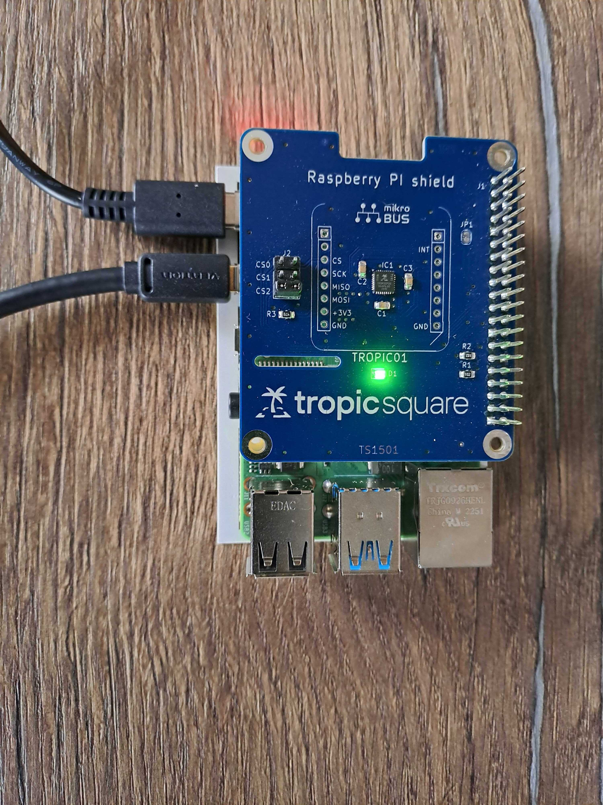

# Linux RPi/Arduino Devkit (SPI) Tutorial
This port should be compatible with most Linux-based systems with a hardware SPI interface, including popular single-board computers such as the Raspberry Pi. It is compatible with our [Raspberry Pi Devkit](https://github.com/tropicsquare/tropic01-raspberrypi-shield-hw). Follow the link to get more details about this Devkit, including schematics, design files, and manufacturing data.

It is recommended to read through the [Libtropic SDK documentation](https://tropicsquare.github.io/libtropic/latest/) before proceeding.

## Hardware Preparation
We recommend using our [Raspberry Pi Devkit](https://github.com/tropicsquare/tropic01-raspberrypi-shield-hw).

> [!IMPORTANT]
> On the Devkit, short the CS2 pins with a jumper.

Your setup should look like the following:

??? info "Show images"
    

    

## Install Dependencies
Make sure to have these dependencies installed:

- CMake
    - Raspbian/Debian/Ubuntu: `sudo apt install cmake`
    - Fedora: `sudo dnf install cmake`
- GCC
    - Raspbian/Debian/Ubuntu: `sudo apt install gcc`
    - Fedora: `sudo dnf install gcc`

MbedTLS 4.0.0, which we use in this tutorial, requires:

- Recent Python
- The following Python packages:
    - jinja2
    - jsonschema

The recommended method is to use Python virtual environment to install those packages. Instructions for Linux:
```shell
python3 -m venv .venv
source .venv/bin/activate
pip3 install --upgrade pip
pip3 install jinja2 jsonschema
```

## System Setup
Make sure that you have:

- The SPI kernel module enabled.
    - On Raspberry Pi, you can use `raspi-config` to enable the module.
- Permissions to access the SPI and GPIO interface.
    - On Raspberry Pi, you must be a member of the `spi` and `gpio` groups.

```bash
# Check if you are in the spi and the gpio group
groups
# Add yourself to each group you are not in
sudo usermod -aG spi "$USER"
sudo usermod -aG gpio "$USER"
```

## Clone the Libtropic Repository

```bash
git clone https://github.com/tropicsquare/libtropic.git
cd libtropic
git submodule update --init --recursive
cd examples/linux/spi_devkit
```

## Build and Run a Basic Hello World Example

This basic example demonstrates basic usage of the Libtropic SDK. In the example, the Secure Session is estabilished and a Ping L3 Command is sent to verify that the Secure Session works.
This example is also useful as a template for your project, as it contains minimal `CMakeLists.txt` to build Libtropic including dependencies.

```bash
cd hello_world
mkdir build
cd build
cmake ..
make
./libtropic_hello_world
```

## Build and Run a Firmware Update Example
After trying out communication, we will update the TROPIC01's firmware using our firmware update example, as new firmware versions fix bugs and ensure compatibility with the latest Libtropic SDK.

> [!IMPORTANT]
> - Using outdated firmware is not recommended. Outdated firmware may not be compatible with the latest version of the Libtropic SDK.
> - Firmware update example will print important information about the chip and its firmwares. Save the output for future reference, as it contains useful information for eventual support.
> - Use a stable power source and avoid disconnecting the devkit or rebooting your computer during the update. Interrupting a firmware update can brick the device.

To update both internal firmware to the latest versions, execute the following example:

```bash
cd fw_update
mkdir build
cd build
cmake ..
make
./libtropic_fw_update
```

The example will prompt you for confirmation. Type `y` to start the update.

After successful execution, your chip will contain the latest firmware and will be compatible with the current Libtropic API.

## FAQ

If you encounter any issues, please check the [FAQ](../../../faq.md) before filing an issue or reaching out to our [support](https://support.desk.tropicsquare.com/).