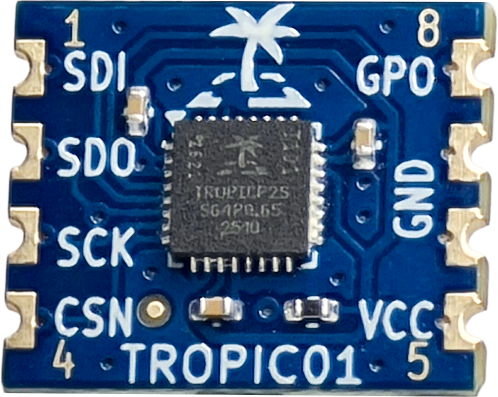

# ESP32 Tutorial
This tutorial will guide you through the building of the examples in the `examples/esp32/` directory. In this directory, there are multiple subdirectories for each supported ESP32 board. Most of the instructions in this tutorial are common for all of the boards.

## Hardware Setup
### TROPIC01
!!! info "TROPI01 Devkit for ESP32 boards"
    Currently, we don't offer a devkit for ESP32 boards. However, you can use any of our devkits that use SPI, except the USB DevKit.

For the purpose of this tutorial, we will use the TROPIC01 Mini Board:
<figure style="text-align: center;">

<figcaption style="font-size: 0.9em; color: #555; margin-top: 0.5em;">
    TROPIC01 Mini Board
  </figcaption>
</figure>
You can get TROPIC01 Mini Board and other devkits [here](https://www.tropicsquare.com/order-devkit).

### Your ESP32 Board
Follow the connection instructions for your ESP32 board below:
!!! example "Connection Instructions"
    === "ESP32-DevKitC-V4"
        ESP32-DevKitC-V4 pin layout [here](https://docs.espressif.com/projects/esp-dev-kits/en/latest/esp32/_images/esp32_devkitC_v4_pinlayout.png).
        

        | ESP32-DevKitC-V4 Pin | TROPIC01 Mini Board Pin |
        |:--------------------:|:-----------------------:|
        | 3V3                  | VCC                     |
        | GND                  | GND                     |
        | GPIO32               | GPO                     |
        | GPIO23               | SDI                     |
        | GPIO19               | SDO                     |
        | GPIO18               | SCK                     |
        | GPIO5                | CSN                     |
        
        

    
    === "ESP32-S3-DevKitC-1"
        ESP32-S3-DevKitC-1 pin layout [here](https://docs.espressif.com/projects/esp-dev-kits/en/latest/esp32s3/_images/ESP32-S3_DevKitC-1_pinlayout_v1.1.jpg).
        

        | ESP32-S3-DevKitC-1 Pin | TROPIC01 Mini Board Pin |
        |:----------------------:|:-----------------------:|
        | 3V3                    | VCC                     |
        | GND                    | GND                     |
        | GPIO1                  | GPO                     |
        | GPIO11                 | SDI                     |
        | GPIO13                 | SDO                     |
        | GPIO12                 | SCK                     |
        | GPIO10                 | CSN                     |
        
        

    === "ESP32-C3-DevKit-RUST-1"
        ESP32-C3-DevKit-RUST-1 pin layout [here](https://www.espboards.dev/img/fBEsfgdrv0-1000.png).
        

        | ESP32-C3-DevKit-RUST-1 Pin | TROPIC01 Mini Board Pin |
        |:--------------------------:|:-----------------------:|
        | 3V3                        | VCC                     |
        | GND                        | GND                     |
        | GPIO10                     | GPO                     |
        | GPIO1                      | SDI                     |
        | GPIO0                      | SDO                     |
        | GPIO3                      | SCK                     |
        | GPIO8                      | CSN                     |
        
        

!!! question "How to Use Different Pins?"
    The pin connections above are used in our examples by default. If you want to use different pins, go to the examples's `main.c`, look for the `app_main()` function and adjust the assignments to the `lt_dev_esp_idf_t` structure.

## Install Dependencies and Prepare the Repository
See below for instructions based on your OS:

!!! example "Installation Instructions"
    === ":fontawesome-brands-linux: Linux"
        1. Setup ESP-IDF and its dependencies:
            - Complete the first 4 steps in the [official ESP-IDF setup guide](https://docs.espressif.com/projects/esp-idf/en/stable/esp32/get-started/linux-macos-setup.html).
            - We recommend getting the 5.5.1 version, but any 5.x.x version should work.
        2. Get the Libtropic repository:
            - Using git: `git clone https://github.com/tropicsquare/libtropic.git`
            - Or you can download the [latest release](https://github.com/tropicsquare/libtropic/releases/latest).

    === ":fontawesome-brands-apple: macOS"
        TBA

    === ":fontawesome-brands-windows: Windows"
        TBA

## Start with our Examples!
!!! warning "Do not skip!"
    We strongly recommend going through each example in this specific order without skipping. You will gather basic information about the chip and update your TROPIC01's firmware, which will guarantee compatibility with the latest Libtropic API.

1. [Chip Identification](identify_chip.md)
2. [FW Update](fw_update.md)
3. [Hello, World!](hello_world.md)

## FAQ
If you encounter any issues, please check the [FAQ](../../faq.md) before filing an issue or reaching out to our [support](https://support.desk.tropicsquare.com/).