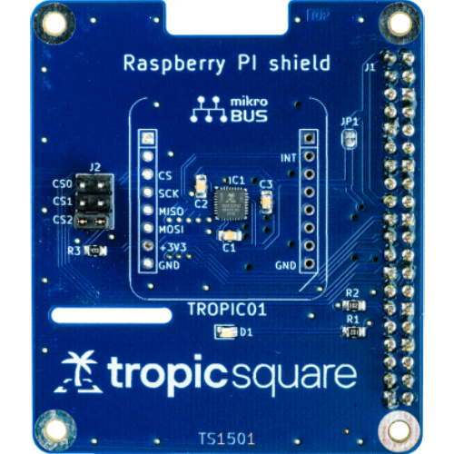
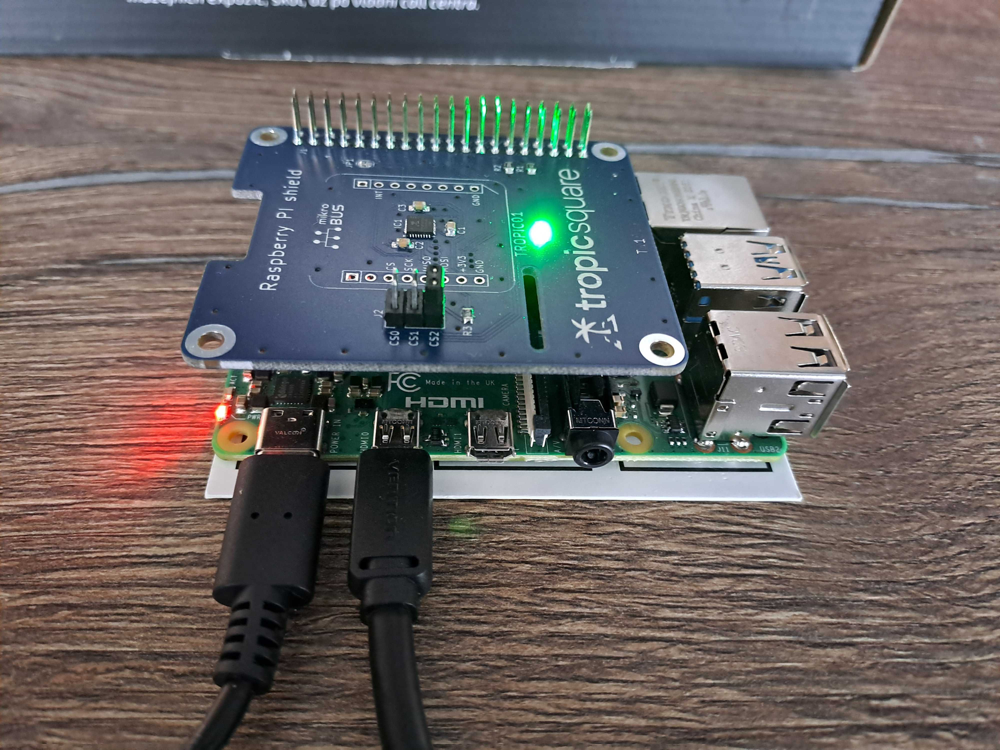

# Linux SPI Tutorial
This tutorial will help you get started with TROPIC01 on Linux-based systems with a hardware SPI interface. We will go through our examples in the `examples/linux/spi/` directory. The used port should be compatible with most Linux-based systems with a hardware SPI interface, including popular single-board computers such as the Raspberry Pi.

## Hardware Setup
For the purpose of this example, we will use [Raspberry Pi 4](https://www.raspberrypi.com/products/raspberry-pi-4-model-b/) as the host platform and our **TROPIC01 Raspberry Pi Shield** (available [here](https://www.tropicsquare.com/order-devkit)). However, any other shield with TROPIC01's SPI pins exposed should work.
<figure style="text-align: center;">

<figcaption style="font-size: 0.9em; color: #555; margin-top: 0.5em;">
    TROPIC01 Raspberry Pi Shield
  </figcaption>
</figure>

!!! info
    If you're using our Raspberry Pi Shield, **short the CS2 pins with a jumper**.

The aforementioned setup looks like the following:

??? info "Show images"
    

    

!!! question "I am not using TROPIC01 Raspberry Pi Shield, how to use different pins?"
    The examples assume that TROPIC01 Raspberry Pi Shield is used by default. The pins and other things can be changed in each example's `main.c` — look for the `main()` function and adjust the initialization of the `lt_dev_linux_spi_t` structure.

## Software Setup
First, install the dependencies and prepare the repository:
!!! example "Installation Instructions"
    1. Install CMake:
        - Ubuntu/Debian: `sudo apt update && sudo apt install cmake`
        - Fedora: `sudo dnf install cmake`
        - Other: [cmake.org](https://cmake.org/download/)
    2. Install GCC and Make via your distribution's package manager:
        - `sudo apt update && sudo apt install build-essential`
    3. Get the Libtropic repository:
        - Using git: `git clone https://github.com/tropicsquare/libtropic.git`
        - Or you can [download latest release](https://github.com/tropicsquare/libtropic/releases/latest).

After that, setup your system:
!!! example "System Setup Instructions"
    Make sure that you have:

    1. The SPI kernel module enabled.
        - On Raspberry Pi, you can use [raspi-config](https://www.raspberrypi.com/documentation/computers/configuration.html) to enable the module.
    2. Permissions to access the SPI and GPIO interface — on Raspberry Pi, you must be a member of the `spi` and `gpio` groups:
    ```bash
    # Check if you are in the spi and the gpio group
    groups
    # Add yourself to each group you are not in
    sudo usermod -aG spi "$USER"
    sudo usermod -aG gpio "$USER"
    # Log out and log in again to reflect changes.
    ```

## Start with our Examples!
!!! warning "Do not skip!"
    We strongly recommend going through each example in this specific order without skipping. You will gather basic information about the chip and update your TROPIC01's firmware, which will guarantee compatibility with the latest Libtropic API.

1. [Chip Identification](identify_chip.md)
2. [FW Update](fw_update.md)
3. [Hello, World!](hello_world.md)

## FAQ
If you encounter any issues, please check the [FAQ](../../../faq.md) before filing an issue or reaching out to our [support](https://support.desk.tropicsquare.com/).