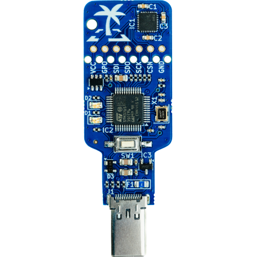

# TROPIC01 USB Devkit Tutorials
These tutorials will help you get started with our TROPIC01 USB Devkit (available [here](https://www.tropicsquare.com/order-devkit)) mainly on Linux-based systems, but it should also be compatible with other POSIX systems. We will go through our examples in the `examples/linux/usb_devkit/` directory.

## Hardware Setup
As mentioned above, we will use our TROPIC01 USB Devkit (available [here](https://www.tropicsquare.com/order-devkit)), specifically the TS1303 version, but other versions should also work:
<figure style="text-align: center;">

<figcaption style="font-size: 0.9em; color: #555; margin-top: 0.5em;">
    TROPIC01 USB Devkit (TS1303)
  </figcaption>
</figure>
Go ahead and plug the USB Devkit into your machine.

## Software Setup
First, install the dependencies and prepare the repository:
!!! example "Installation Instructions"
    1. Install CMake:
        - Ubuntu/Debian: `sudo apt update && sudo apt install cmake`
        - Fedora: `sudo dnf install cmake`
        - Other: [cmake.org](https://cmake.org/download/)
    2. Install GCC and Make via your distribution's package manager:
        - `sudo apt update && sudo apt install build-essential`
    3. Get the Libtropic repository:
        - Using git: `git clone https://github.com/tropicsquare/libtropic.git`
        - Or you can [download latest release](https://github.com/tropicsquare/libtropic/releases/latest).

After that, setup your system:
!!! example "System Setup Instructions"
    Make sure you have access to a USB UART interface. Usually, your user account has to be a member of a certain group, usually the `dialout` group:
    ```bash
    # Check if you are in the dialout group
    groups
    # If not, add yourself to the dialout group
    sudo usermod -aG dialout "$USER"
    # Log out and log in again to reflect changes.
    ```

## Start with our Tutorials!
!!! warning "Do not skip!"
    We strongly recommend going through each tutorial in this specific order without skipping. You will gather basic information about the chip and update your TROPIC01's firmware, which will guarantee compatibility with the latest Libtropic API.

1. [Chip Identification](identify_chip.md)
2. [FW Update](fw_update.md)
3. [Hello, World!](hello_world.md)
4. [Full Chain Verification](full_chain_verification.md)

## FAQ
If you encounter any issues, please check the [FAQ](../../../faq.md) before filing an issue or reaching out to our [support](https://support.desk.tropicsquare.com/).
