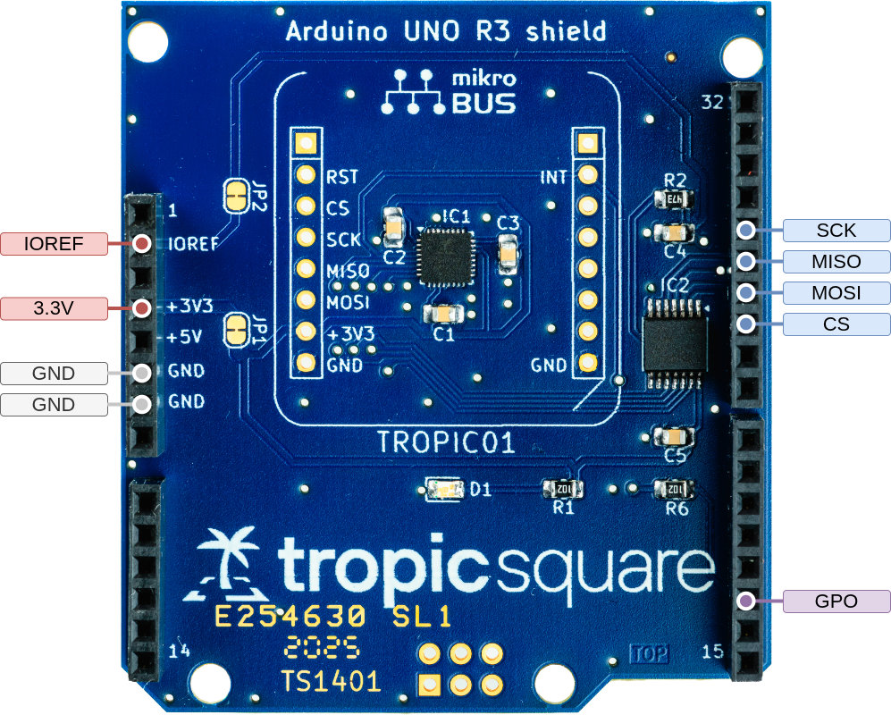

# STM32 Tutorial
This tutorial will help you get started with TROPIC01 on STM32-based platforms using Libtropic. Currently, we officially support [Nucleo F439ZI](https://www.st.com/en/evaluation-tools/nucleo-f439zi.html) and [Nucleo L432KC](https://www.st.com/en/evaluation-tools/nucleo-l432kc.html) development boards.

We will go through our examples in the `examples/stm32/` directory. In this directory, there are multiple subdirectories for each supported Nucleo board. Most of the instructions in this tutorial are common for all of the boards.

## Hardware Setup

!!! example "Connection Instructions"
    === "Nucleo F439ZI"
        The Nucleo F439ZI board is compatible with our **TROPIC01 Arduino Shield**, which we recommend for this tutorial. You can get the shield [here](https://www.tropicsquare.com/order-devkit).

        <figure style="text-align: center;">
        
        <figcaption style="font-size: 0.9em; color: #555; margin-top: 0.5em;">
            TROPIC01 Arduino Shield pinout
        </figcaption>
        </figure>

        If you have any other shield which exposes SPI connections (or a custom PCB), you can use it as well, but you have to connect it manually e.g., using DuPont (jumper) wires. Refer to the table below for wiring:
        
        |  TROPIC01     |   NUCLEO F439ZI  |
        |---------------|------------------|
        |  GND          |  GND             |
        |  3V3          |  3V3             |
        |  MISO (SDO)   |  GPIOA_6         |
        |  MOSI (SDI)   |  GPIOA_7         |
        |  SCK          |  GPIOA_5         |
        |  CS (CSN)     |  GPIOD_14        |
        |  GPO          |  GPIOF_15        |

    
    === "Nucleo L432KC"
        We do not offer a shield compatible with the Nucleo L432KC. You can use any of our shields (available [here](https://www.tropicsquare.com/order-devkit)) which expose SPI connections (or a custom PCB). Connect the TROPIC01 to the Nucleo L432KC according to the table below:

        |  TROPIC01     |  NUCLEO L432KC  |
        |---------------|-----------------|
        |  GND          |  GND            |
        |  3V3          |  3V3            |
        |  MISO (SDO)   |  A6             |
        |  MOSI (SDI)   |  A5             |
        |  SCK          |  A4             |
        |  CS (CSN)     |  A3             |
    
    ??? question "Advanced: How to Use Different Nucleo Pins?"
        The pin assignments above are used in our examples by default. The pins can be changed in the source code of each example. However, apart from changing assignment, you also have to initialize different peripherals, which is not documented here.

## Install Dependencies and Prepare the Repository
Choose and follow instructions depending on your OS:

!!! example "Installation Instructions"
    === ":fontawesome-brands-linux: Linux"
        1. Install CMake:
            - Ubuntu/Debian: `sudo apt update && sudo apt install cmake`
            - Fedora: `sudo dnf install cmake`
            - Other: [cmake.org](https://cmake.org/download/)
        2. Install Make:
            - Ubuntu/Debian: `sudo apt update && sudo apt install make`
            - Fedora: `sudo dnf install make`
        3. Install GCC cross-compiler for ARM:
            - Ubuntu/Debian: `sudo apt update && sudo apt install gcc-arm-none-eabi`
            - Fedora: `sudo dnf install arm-none-eabi-gcc`
        4. Install [OpenOCD](https://openocd.org/pages/getting-openocd.html):
            - Ubuntu/Debian: `sudo apt update && sudo apt install openocd`
            - Fedora: `sudo dnf install openocd`
        5. Install a serial monitor of your choice (`minicom`, `screen`, `GTKTerm`).
            - For beginners we recommend GUI-based GTKTerm.
                - Ubuntu/Debian: `sudo apt update && sudo apt install gtkterm`
                - Fedora: `sudo dnf install gtkterm`
        6. Get the Libtropic repository:
            - Using git: `git clone https://github.com/tropicsquare/libtropic.git`
            - Or you can [download latest release](https://github.com/tropicsquare/libtropic/releases/latest).

    === ":fontawesome-brands-apple: macOS"
        TBA

    === ":fontawesome-brands-windows: Windows"
        TBA

!!! example "System Setup Instructions"
    === ":fontawesome-brands-linux: Linux"
        To upload the example programs, you need to have access to USB devices (usually, you must be a member of the `plugdev` group). Also, permissions (udev rules) have to be correctly configured, refer to the [OpenOCD documentation](https://openocd.org/pages/documentation.html).

        As the output of examples is printed to the serial port, you need an access to it. Either run the serial port monitor as root, or you have to add yourself to a group with access to serial ports. Usually, you must be a member of the `dialout` group.

        ```bash
        # Check if you are in the plugdev and the dialout groups. Required groups can
        # be different, check the documentation of your Linux distribution
        groups
        # Add yourself to each group you are not in
        sudo usermod -aG plugdev "$USER"
        sudo usermod -aG dialout "$USER"
        # Log out and log in again to reflect changes
        ```
    
    === ":fontawesome-brands-apple: macOS"
        TBA

    === ":fontawesome-brands-windows: Windows"
        TBA

## Start with our Examples!
!!! warning "Do not skip!"
    We strongly recommend going through each example in this specific order without skipping. You will gather basic information about the chip and update your TROPIC01's firmware, which will guarantee compatibility with the latest Libtropic API.

1. [Chip Identification](identify_chip.md)
2. [FW Update](fw_update.md)
3. [Hello, World!](hello_world.md)

## FAQ
If you encounter any issues, please check the [FAQ](../../faq.md) before filing an issue or reaching out to our [support](https://support.desk.tropicsquare.com/).